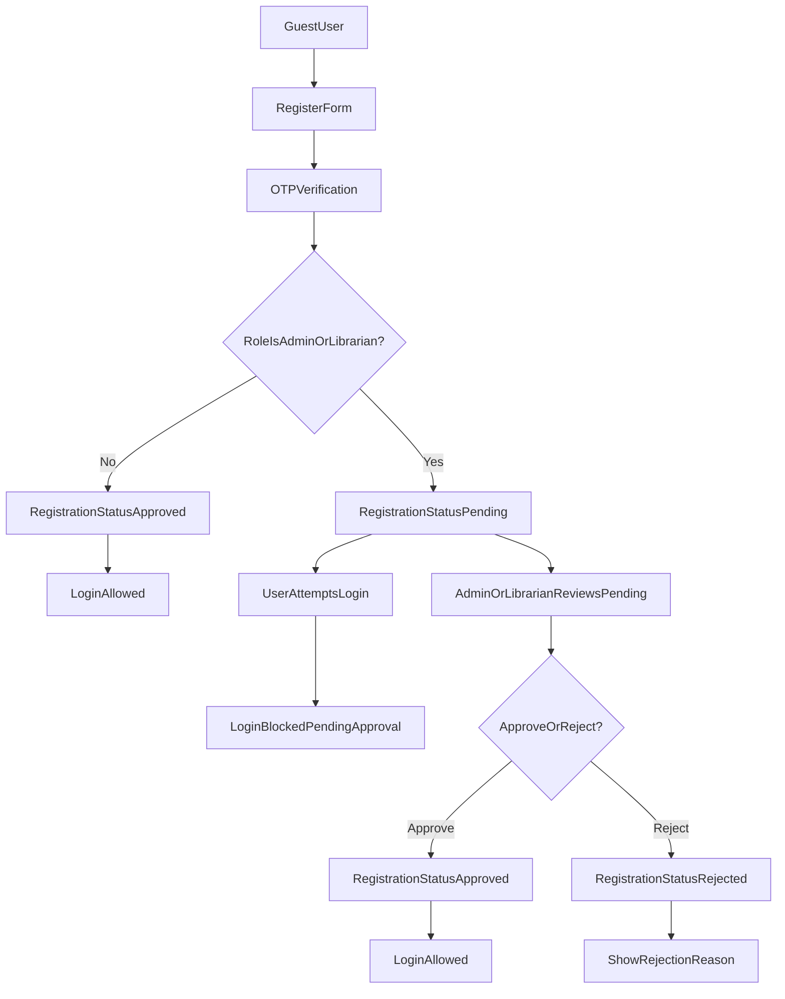
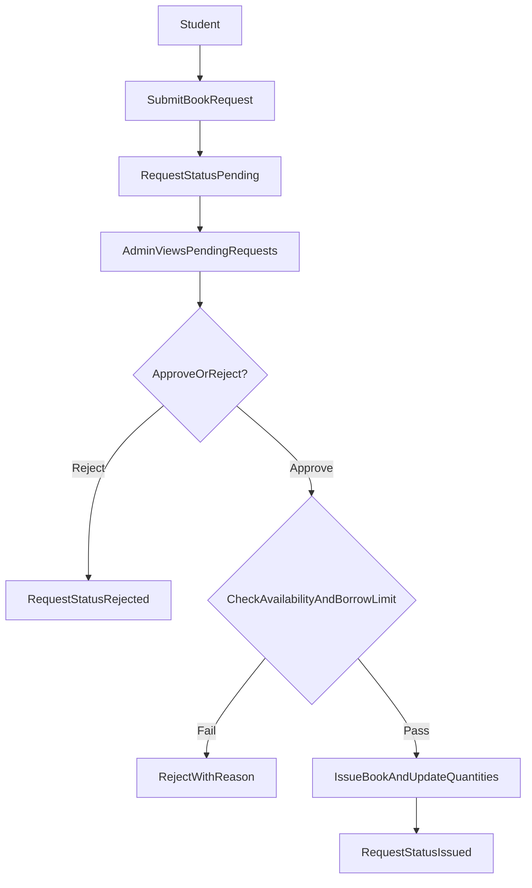
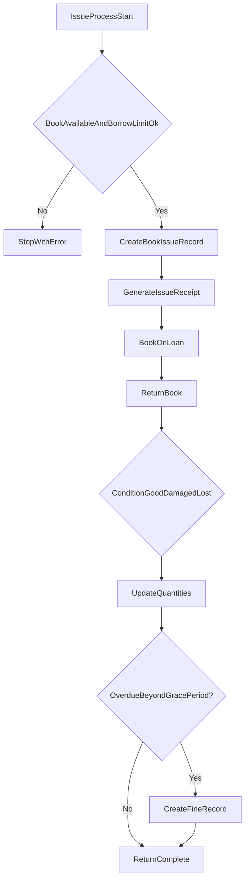
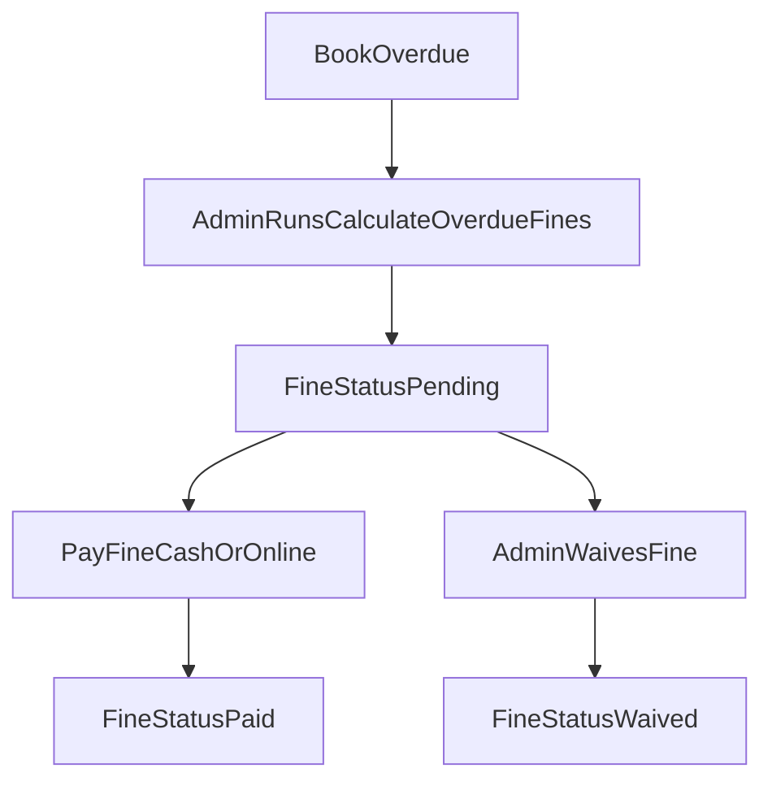
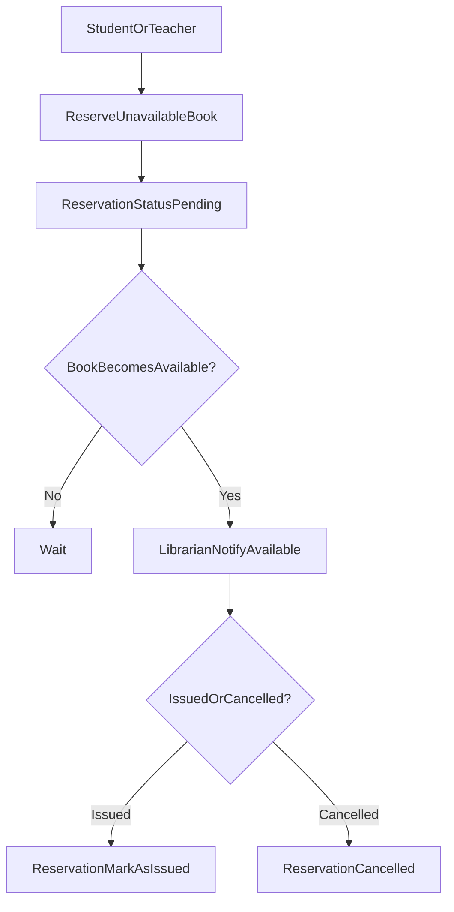
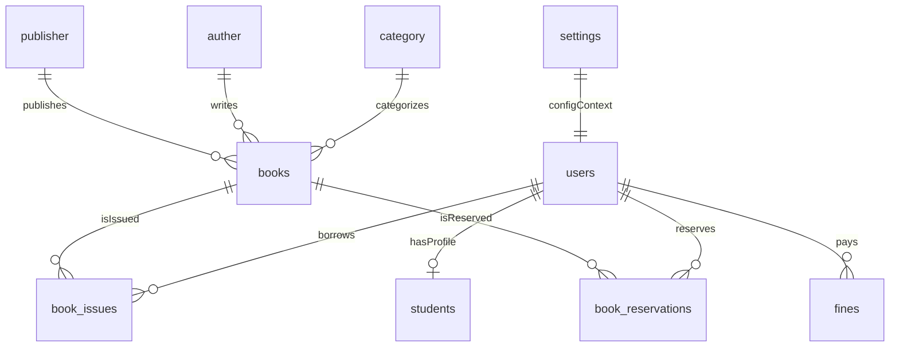

# Library Management System (E‑Library) — Client Documentation

## Table of contents

-   [1. Executive summary](#1-executive-summary)
-   [2. System architecture](#2-system-architecture)
    -   [2.1 Technology stack](#21-technology-stack)
    -   [2.2 User roles](#22-user-roles)
    -   [2.3 Role-based access matrix](#23-role-based-access-matrix)
-   [3. Complete feature list (modules)](#3-complete-feature-list-modules)
-   [4. End-to-end system flows (visual)](#4-end-to-end-system-flows-visual)
    -   [4.1 Authentication and registration approval flow](#41-authentication-and-registration-approval-flow)
    -   [4.2 Book request and approval flow](#42-book-request-and-approval-flow)
    -   [4.3 Issue and return flow (with fine generation)](#43-issue-and-return-flow-with-fine-generation)
    -   [4.4 Reservation flow](#44-reservation-flow)
-   [5. Feature details](#5-feature-details)
    -   [5.1 User registration, OTP verification, approval](#51-user-registration-otp-verification-approval)
    -   [5.2 Dashboard](#52-dashboard)
    -   [5.3 Books, authors, publishers, categories](#53-books-authors-publishers-categories)
    -   [5.4 Issue/return, receipts, book condition](#54-issuereturn-receipts-book-condition)
    -   [5.5 Fine management](#55-fine-management)
    -   [5.6 Reservations](#56-reservations)
    -   [5.7 Reports](#57-reports)
    -   [5.8 Chatbot (Student only)](#58-chatbot-student-only)
    -   [5.9 E‑book reading (Student only)](#59-e-book-reading-student-only)
    -   [5.10 Settings](#510-settings)
-   [6. Technical specifications](#6-technical-specifications)
    -   [6.1 Key routes (web)](#61-key-routes-web)
    -   [6.2 Data model overview (ER diagram)](#62-data-model-overview-er-diagram)
-   [7. Installation & setup](#7-installation--setup)
-   [8. User guides (by role)](#8-user-guides-by-role)
    -   [8.1 Admin guide](#81-admin-guide)
    -   [8.2 Librarian guide](#82-librarian-guide)
    -   [8.3 Teacher guide](#83-teacher-guide)
    -   [8.4 Student guide](#84-student-guide)
-   [9. Configuration reference](#9-configuration-reference)
-   [10. Troubleshooting & FAQ](#10-troubleshooting--faq)

---

## 1. Executive summary

This project is a **Laravel-based Library Management System (E‑Library)** designed to manage a library’s full operational workflow:

-   **Catalog management** (books, categories, authors, publishers, cover images)
-   **Member management** (students/teachers/librarians/admin)
-   **Book issuing/returning** with **borrow limits**, **receipts**, and **book condition**
-   **Fine management** with **grace period** and payment tracking
-   **Reservations** for unavailable books
-   **Reports & analytics** for operations and insights
-   **Student tools**: chatbot assistant and e‑book reading

Primary benefits for the client:

-   Faster book issue/return operations with automated validations
-   Better transparency through dashboards and reports
-   Controlled access with role-based permissions and approval workflows

---

## 2. System architecture

### 2.1 Technology stack

-   **Backend**: Laravel 8.x (PHP 8.0+)
-   **Database**: MySQL / MariaDB
-   **Frontend**: Blade templates (Bootstrap-based UI)
-   **Auth**: Session auth with role checks and verification middleware

### 2.2 User roles

The system supports these roles:

-   **Admin**: Full system access (configuration, all modules)
-   **Librarian**: Operational role (supported in database; UI exposure depends on menu + controller checks)
-   **Teacher**: Member role (supported in database; UI exposure depends on menu + controller checks)
-   **Student**: Member role (student dashboard + student-only features)

Important note (current implementation):

-   The **registration form/controller** currently validates role as **Student or Admin** (OTP-based registration flow).
-   The **database factory** supports roles: Student, Teacher, Librarian, Admin.
-   The **navigation menu** in `resources/views/layouts/app.blade.php` primarily exposes operational modules to **Admin** (and Student-only items to Students). If you want Librarian/Teacher to see those menus, the UI needs to be extended.

### 2.3 Role-based access matrix

This documentation provides two perspectives:

-   **UI/Menu access**: what users can reach through navigation.
-   **Enforced controller access**: what the backend explicitly restricts by role.

#### UI/Menu access (default navigation)

| Module / Action                                                | Student | Teacher | Librarian | Admin |
| -------------------------------------------------------------- | ------: | ------: | --------: | ----: |
| Login / Logout                                                 |      ✅ |      ✅ |        ✅ |    ✅ |
| Register (OTP)                                                 |      ✅ |      ❌ |        ❌ |    ✅ |
| Approve registrations                                          |      ❌ |      ❌ |        ❌ |    ✅ |
| Manage books (CRUD)                                            |      ❌ |      ❌ |        ❌ |    ✅ |
| Manage authors/publishers/categories/members                   |      ❌ |      ❌ |        ❌ |    ✅ |
| View books & search                                            |      ✅ |      ✅ |        ✅ |    ✅ |
| Request book (self-service)                                    |      ✅ |      ❌ |        ❌ |    ❌ |
| View my requests                                               |      ✅ |      ❌ |        ❌ |    ❌ |
| Issue/return management screens                                |      ❌ |      ❌ |        ❌ |    ✅ |
| View own fines / pay own fines                                 |      ✅ |      ✅ |        ✅ |    ✅ |
| View all fines / waive / calculate overdue                     |      ❌ |      ❌ |        ❌ |    ✅ |
| Reservations module                                            |      ❌ |      ❌ |        ❌ |    ✅ |
| Reports module                                                 |      ❌ |      ❌ |        ❌ |    ✅ |
| Settings (return days, fine rate, grace period, borrow limits) |      ❌ |      ❌ |        ❌ |    ✅ |
| Chatbot                                                        |      ✅ |      ❌ |        ❌ |    ❌ |
| E‑book reading                                                 |      ✅ |      ❌ |        ❌ |    ❌ |

Notes:

-   Registration approval for Admin/Librarian is documented in `REGISTRATION_APPROVAL_SYSTEM.md`.
-   Book request approval flow is documented in `BOOK_REQUEST_APPROVAL_SYSTEM.md`.
-   Fine permissions are detailed in `FINE_MANAGEMENT_PERMISSIONS.md`.

#### Enforced controller access (key restrictions)

| Feature                        | Restriction enforced in controllers                                           |
| ------------------------------ | ----------------------------------------------------------------------------- |
| Book create/store              | Admin only (`BookController`)                                                 |
| Fine waive / calculate overdue | Admin only (`FineController`)                                                 |
| Chatbot                        | Student only (`ChatBotController`)                                            |
| Reading                        | Student only (routes labeled Student only; enforce via controller if present) |

---

## 3. Complete feature list (modules)

### User management

-   Registration with role selection (Student/Teacher/Librarian/Admin)
-   OTP verification support
-   Registration approval workflow for Admin/Librarian
-   Profile view/edit
-   Change password

### Library catalog

-   Book CRUD with cover image upload
-   Category, Author, Publisher management
-   Quantity tracking (total/available/issued)
-   Advanced search and suggestions

### Issue/return management

-   Issue workflow with validations (availability, borrowing limits)
-   Return workflow with condition tracking (good/damaged/lost)
-   Automatic receipt numbers (Issue / Return)

### Fine management

-   Fine calculation with grace period and per-day rate
-   Manual “calculate overdue fines” action for batch generation
-   Payment tracking (cash/online) + payment notes
-   Waiving fines (admin/librarian)
-   Fine history

### Reservations

-   Reserve a book when unavailable
-   Cancel reservations
-   Notify availability and mark as issued
-   Reservation status tracking and expiry logic

### Reports & analytics

-   Book report
-   Member report
-   Return report
-   Overdue report
-   Fine collection report
-   Category statistics
-   Export framework routes (PDF/Excel integration can be added)

### Student features

-   Chatbot assistant: Q&A and CSE books search
-   E‑book reading module (preview/PDF route)

---

## 4. End-to-end system flows (visual)

### 4.1 Authentication and registration approval flow

### 4.2 Book request and approval flow

### 4.3 Issue and return flow (with fine generation)

### 4.5 Fine status flow

### 4.4 Reservation flow

---

## 5. Feature details

### 5.1 User registration, OTP verification, approval

-   Registration uses **OTP email verification**: the account is created only after OTP verification succeeds.
-   The current registration flow validates role as **Student** or **Admin**.
-   Admin registrations may require approval depending on configured approval logic (see `REGISTRATION_APPROVAL_SYSTEM.md`).
-   Rejected registrations store a reason and cannot login.

Related docs:

-   `REGISTRATION_APPROVAL_SYSTEM.md`

### 5.2 Dashboard

Role-based dashboards show different metrics and shortcuts.

-   Admin/Librarian: system-wide totals, overdue books, pending reservations/registrations
-   Student/Teacher: personal issued books, fines, reservations

### 5.3 Books, authors, publishers, categories

Core catalog operations:

-   Add/edit/delete books
-   Upload book cover images
-   Quantity tracking and availability
-   Search and filters by name/author/ISBN/category/etc.

### 5.4 Issue/return, receipts, book condition

Operational workflows:

-   Issue books with validation (availability + borrow limit)
-   Return books and record condition (good/damaged/lost)
-   Generate unique receipts for auditing

Request statuses (book issue records):

-   `pending`: student request awaiting approval
-   `approved`: approved (intermediate)
-   `issued`: issued to student
-   `rejected`: rejected with reason

### 5.5 Fine management

Fine logic:

-   Grace period: fine starts after X days past return date
-   Rate: fine per day after grace period
-   Fine records can be **paid** or **waived**

Related docs:

-   `FINE_MANAGEMENT_PERMISSIONS.md`

Implementation notes:

-   **Students** can only view and pay **their own** fines.
-   **Admin** can calculate overdue fines and waive fines (controller-level restriction).

### 5.6 Reservations

Reservations allow users to reserve unavailable books and track status.

Implementation notes:

-   Reservations are managed from the Admin navigation menu (UI).
-   The reservation controller supports creating/cancelling and moving reservations through statuses (pending → available → issued/cancelled).

### 5.7 Reports

Reports provide filtering and analytics for admin/librarian users:

-   Book/member/return/overdue/fine collection/category stats

### 5.8 Chatbot (Student only)

The chatbot supports:

-   Q&A responses loaded from `storage/app/chatbot_qa.csv`
-   Book search (CSE-focused) based on message pattern detection

Routes:

-   `GET /chatbot`
-   `POST /chatbot/chat`

### 5.9 E‑book reading (Student only)

Reading module provides:

-   Reading index
-   Book reading page
-   PDF preview endpoint

### 5.10 Settings

Configurable system settings include:

-   Return days
-   Fine per day
-   Fine grace period
-   Borrowing limits per role

---

## 6. Technical specifications

### 6.1 Key routes (web)

Authentication and registration:

-   `GET /` (login page)
-   `POST /` (login)
-   `POST /logout`
-   `GET /register`, `POST /register`
-   `GET /verify-otp`, `POST /verify-otp`, `POST /resend-otp`

Core modules (authenticated):

-   `GET /dashboard`
-   Books: `GET /books`, `GET /book/create`, `POST /book/create`, `GET /book/edit/{book}`, `POST /book/update/{id}`, `POST /book/delete/{id}`
-   Students: `GET /students`, `GET /student/create`, `POST /student/create`, `GET /student/edit/{student}`, `POST /student/update/{id}`, `POST /student/delete/{id}`
-   Issue: `GET /book_issue`, `GET /book-issue/create`, `POST /book-issue/create`, plus approval routes
-   Fines: `GET /fines`, `GET /fines/history`, `POST /fines/pay/{id}`, `POST /fines/waive/{id}`, `POST /fines/calculate-overdue`
-   Reservations: `GET /reservations`, `POST /reservations/reserve`, `POST /reservations/cancel/{id}`, `POST /reservations/notify/{bookId}`, `POST /reservations/mark-issued/{id}`
-   Reports: `GET /reports/*`
-   Settings: `GET /settings`, `POST /settings`
-   Chatbot: `GET /chatbot`, `POST /chatbot/chat`
-   Reading: `GET /reading`, `GET /reading/{book}`, `GET /reading/{book}/pdf`

### 6.2 Data model overview (ER diagram)

### 6.3 Database tables (key fields)

This section summarizes the most important tables and fields (high-level).

#### `books`

-   `name`
-   `isbn` (nullable, unique)
-   `edition` (nullable)
-   `publication_year` (nullable)
-   `description` (nullable)
-   `cover_image` (nullable)
-   `total_quantity`, `available_quantity`, `issued_quantity`
-   (optional) `pdf_file` (PDF upload for reading module)

#### `book_issues`

-   `student_id`, `book_id`
-   `issue_date`, `return_date`, `return_day`
-   `issue_status` (issued/returned tracking)
-   `request_status` (pending/approved/issued/rejected)
-   `fine_amount`, `is_overdue`, `fine_notified`
-   `book_condition` (good/damaged/lost), `damage_notes`
-   `issue_receipt_number`, `return_receipt_number`

#### `fines`

-   `book_issue_id`, `user_id`, `student_id`
-   `amount`, `days_overdue`
-   `status` (pending/paid/waived)
-   `payment_method` (cash/online), `paid_at`, `notes`

#### `book_reservations`

-   `book_id`, `user_id`, `student_id`
-   `status` (pending/available/issued/cancelled)
-   `reserved_at`, `notified_at`, `expires_at`

#### `users` and `students`

-   Users store account identity + role + registration fields.
-   Student table stores member-specific borrowing info (including borrowing limits).

---

## 7. Installation & setup

Prerequisites:

-   PHP 8.0+
-   Composer
-   MySQL/MariaDB
-   Node.js + npm

Steps:

1. Install PHP dependencies:
    - `composer install`
2. Install JS dependencies:
    - `npm install && npm run dev`
3. Create `.env` from `.env.example` and configure DB.
4. Generate app key:
    - `php artisan key:generate`
5. Run migrations + seed:
    - `php artisan migrate:fresh --seed`
6. Create storage link for cover images:
    - `php artisan storage:link`
7. Start server:
    - `php artisan serve`

Recommended `.env` settings (minimum):

-   `APP_URL` (example: `http://localhost:8000`)
-   Database:
    -   `DB_CONNECTION=mysql`
    -   `DB_HOST=127.0.0.1`
    -   `DB_PORT=3306`
    -   `DB_DATABASE=lms`
    -   `DB_USERNAME=...`
    -   `DB_PASSWORD=...`
-   Mail (required for OTP registration):
    -   `MAIL_MAILER=smtp`
    -   `MAIL_HOST=...`
    -   `MAIL_PORT=...`
    -   `MAIL_USERNAME=...`
    -   `MAIL_PASSWORD=...`
    -   `MAIL_ENCRYPTION=tls` (or as provided)
    -   `MAIL_FROM_ADDRESS=...`
    -   `MAIL_FROM_NAME="eLibrary"`

Default access:

-   See `LOGIN_CREDENTIALS.md` for default usernames/passwords.

Production checklist (quick):

-   Set `APP_ENV=production`, `APP_DEBUG=false`
-   Configure `APP_URL` to your domain
-   Run `php artisan config:cache && php artisan route:cache && php artisan view:cache`
-   Confirm storage permissions and `storage:link`
-   Configure mail for OTP and notifications
-   Change default passwords and restrict admin account creation as needed

---

## 8. User guides (by role)

### 8.1 Admin guide

Typical workflow:

-   Review and approve pending Admin/Librarian registrations
-   Manage all catalog data (books, authors, publishers, categories)
-   Configure settings (fine rates, grace period, return days, borrow limits)
-   Monitor reports and overdue/fines

Daily operations checklist:

-   Add/update books and quantities
-   Review pending book requests and approve/reject
-   Issue books directly when needed
-   Process returns and record condition
-   Run “Calculate Overdue Fines” periodically
-   Waive fines when applicable (policy-based)
-   Manage reservations (notify availability / mark as issued)
-   Use reports for oversight

### 8.2 Librarian guide

In the current UI, Librarian menus may not be shown by default.

If Librarian access is enabled in your deployment, typical workflow:

-   Operate issue/return desk tasks
-   Review pending book requests (approve/reject)
-   Handle reservations (notify availability, mark issued)
-   Assist students with book search and availability checks

### 8.3 Teacher guide

Typical workflow:

-   Browse books and request/reserve
-   View issued books and due dates
-   View and pay fines (if any)

Note: teacher role is supported in the database factory, but may not be available via the current OTP registration form.

### 8.4 Student guide

Typical workflow:

-   Browse/search books
-   Request/reserve books
-   Use chatbot to search and ask library questions
-   Read available e‑books (if configured)
-   View and pay fines

---

## 9. Configuration reference

Settings page (Admin only):

-   **Return days**: default loan period
-   **Fine per day**: daily fine amount
-   **Fine grace period**: number of days after due date before fines start
-   **Borrowing limits**: per-role limits (Student/Teacher/Librarian)

Fine formula:

-   ChargeableDays = max(0, DaysOverdue − GracePeriod)
-   Fine = ChargeableDays × FinePerDay

Operational recommendations:

-   Run **Calculate Overdue Fines** daily/weekly to keep fine records current.
-   Set a grace period that matches your library policy (commonly 7–14 days).
-   Review borrowing limits periodically based on member categories.

---

## 10. Troubleshooting & FAQ

### Common issues

-   **Images not showing**: run `php artisan storage:link` and confirm `public/storage` exists.
-   **Migration errors** (development): run `php artisan migrate:fresh --seed`.
-   **Permission errors (Linux/Mac)**: `chmod -R 775 storage bootstrap/cache`.
-   **OTP email not sent**: verify SMTP settings in `.env` and ensure your server can connect to the mail host/port. OTP registration depends on working mail.

### FAQ

-   **Why can’t a new Admin login?** Admin/Librarian accounts require approval first.
-   **Why don’t fines appear automatically?** Overdue fines are generated by Admin/Librarian using “Calculate Overdue Fines”.
-   **Why can’t I create books?** Book creation is restricted to Admin in `BookController`.
